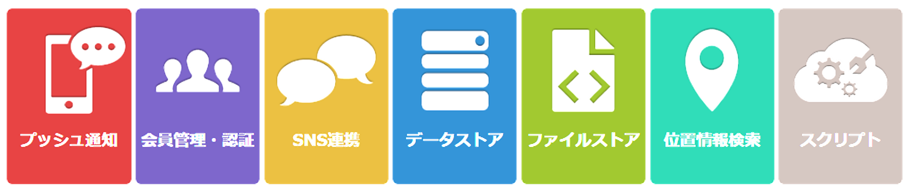

# 位置情報プッシュ通知でO2Oアプリを<br/>作ってみよう（Android）

## 概要

[ニフクラ mobile backend](https://mbaas.nifcloud.com/)のプッシュ通知・位置情報検索を利用して、位置情報に連動したプッシュ通知を配信するO2Oアプリを作成するチュートリアルです


## ニフクラmobile backendとは
スマートフォンアプリのバックエンド機能（プッシュ通知・データストア・会員管理・ファイルストア・SNS連携・位置情報検索・スクリプト）が**開発不要**、しかも基本**無料**(注1)で使えるクラウドサービス！

<center></center>

注1：詳しくは[こちら](https://mbaas.nifcloud.com/function.htm)をご覧ください

<div style="page-break-before:always"></div>

## 動作確認環境
- ニフクラ  mobile backendの無料アカウント
- Android Studio
 - SDK Managerを使って以下のライブラリをインストールしてください
  - Android Support Library
  - Google Play Service
- 検証用のAndroidデバイス

## 作業手順

* 前半：プッシュ通知の受信設定
* 後半：位置情報との連動

## 前半：プッシュ通知の受信設定
### 1.ニフクラ mobile backendの設定

* [ニフクラ mobile backend](https://console.mbaas.nifcloud.com)にログインしてアプリを作成


* 以下のアプリ作成完了画面が表示されればOKです 


* この２種類のAPIキー（アプリケーションキーとクライアントキー）はXcodeで作成するiOSアプリにニフクラ mobile backendを紐付けるために使用します


### 2. プロジェクトダウンロード

下記リンクをクリックしてプロジェクトをダウンロードしてください▼

__[サンプルプロジェクト](https://github.com/NIFCloud-mbaas/GeolocationPush_android/archive/masked_for_hands_on.zip)__

- 参考：完成品プロジェクトもご用意しています
 - [完成品](https://github.com/NIFCloud-mbaas/GeolocationPush_android/archive/master.zip)

#### サンプルプロジェクトで実施済みなこと

- Android SDKのインストール
- 必要なクラスの作成
- ハンズオンで扱わない部分の実装

### 3. Android Studioでプロジェクトを開く

- Open an existing Android Studio project
- 解凍したzipファイルのフォルダを選択


### 4. SDKの初期化設定

MainActivityの`onCreate`メソッドにあるSDKの初期化処理を  
作成したAPIキーに書き換えてください

```java
NCMB.initialize(
    this.getApplicationContext(),
    "YOUR_APP_KEY",
    "YOUR_CLIENT_KEY"
);
```

### 5. プッシュ通知機能を許可

アプリ設定メニューからプッシュ通知の設定を開いてください
- プッシュ通知機能を許可


### 6. google-service.jsonとFirebase秘密鍵の設定

FCM対応したプッシュ通知を送信する場合、google-service.jsonをアプリに配置してただくのと、Firebaseの秘密鍵をmobile backendにアップロードしていただく必要があります。
以下のドキュメントを参考に、google-service.jsonとFirebase秘密鍵の設定を行ってください。

__▼ google-service.jsonとFirebase秘密鍵の設定方法について ▼__<br>https://mbaas.nifcloud.com/doc/current/common/push_setup_fcm_json.html

### 7. AndroidManifest.xmlの編集

- application要素の中でパーミッションを設定
 - サンプルプロジェクトでは実施済みです

```xml
<uses-permission android:name="android.permission.INTERNET" />
<uses-permission android:name="android.permission.ACCESS_NETWORK_STATE" />
<uses-permission android:name="android.permission.GET_ACCOUNTS" />
<uses-permission android:name="android.permission.WAKE_LOCK" />
<uses-permission android:name="android.permission.VIBRATE" />
```

- FcmListenerServiceを定義
 - 今回は受信処理をカスタマイズするので、クラスを別で用意します
 - サンプルプロジェクトでは実施済みです

```xml
<service
    android:name="biz.ncmb.geolocationpush.CustomFcmListenerService"
    android:exported="false">
    <intent-filter>
        <action android:name="com.google.firebase.MESSAGING_EVENT"/>
    </intent-filter>
</service>
```

### 8. アプリを実行してみましょう

1. アプリを起動
2. installationを確認
3. プッシュ通知を配信
4. プッシュ通知を受信できたかを確認

## 後半：位置情報との連動

### 1. 店舗情報の準備

- データストアにLocationという名前のクラスを作成
- Locationクラスにnameとgeoフィールドを追加
- 新しいレコードを追加して店舗を登録
 - 現在地を緯度経度で指定してください
 - 例）name: ニフティ、geo: 35.696174,139.68951
- **geoフィールドは入力形式を緯度経度に変更してください**


### 2. Geofence設定までの流れ

1. 受信したプッシュ通知の内容をもとにロケーションをデータストアから取得
2. GeofenceRequestを作成
3. Google API Clientの設定
4. GeofenceRequestを設定

### 3. ロケーションの取得

プッシュ通知内のデータ（ペイロード）を取得する場合は、  
FcmListenerServiceを拡張し、`onMessageReceived`メソッドを上書きします

```java
@Override
public void onMessageReceived(RemoteMessage remoteMessage) {
	Bundle data = getBundleFromRemoteMessage(remoteMessage);
public void onMessageReceived(String from, Bundle data) {
    //ペイロードデータの取得
    if (data.containsKey("com.nifcloud.mbaas.Data")) {
        try {
            JSONObject json = new JSONObject(data.getString("com.nifcloud.mbaas.Data"));
        } catch (JSONException e) {
            //エラー処理
            Log.e(TAG, "error:" + e.getMessage());
        }
    }
    //デフォルトの通知を実行する場合はsuper.onMessageReceivedを実行する
    //super.onMessageReceived(remoteMessage);
}
```

### 4. ロケーションの取得

ペイロードデータ内のlocation_idをもとに、データストアからロケーションを取得します

JSONオブジェクトの作成後に続きの実装をしてください

```java
JSONObject json = new JSONObject(data.getString("com.nifcloud.mbaas.Data"));

//SDKの再初期化が必要
NCMB.initialize(
        this.getApplicationContext(),
        "YOUR_APP_KEY",
        "YOUR_CLIENT_KEY"
);

//Locationデータの取得
NCMBObject point = new NCMBObject("Location");
try {
    point.setObjectId(json.getString("location_id"));
    point.fetch();
    Log.d(TAG, "location name:" + point.getString("name"));
} catch (NCMBException e) {
    e.printStackTrace();
}
```

### 5. メソッドの呼び出しを追加

このあと実装するメソッドの呼び出しを追加

- `createGeofenceRequest(point)`：Geofenceの作成
- `connectGoogleApiClient()`：Google API Clientのビルドと接続

```java
JSONObject json = new JSONObject(data.getString("com.nifcloud.mbaas.Data"));

//Locationデータの取得
NCMBObject point = new NCMBObject("Location");
try {
    point.setObjectId(json.getString("location_id"));
    point.fetch();
    Log.d(TAG, "location name:" + point.getString("name"));
} catch (NCMBException e) {
    e.printStackTrace();
}

//geofenceの作成
createGeofenceRequest(point);

//Google API Clientのビルドと接続
connectGoogleApiClient();
```

### 6. GeofenceRequestの作成

`createGeofenceRequest`メソッドを実装していきます

- Geofenceオブジェクトの作成

```java
//Geofenceオブジェクトの作成
Geofence geofence = new Geofence.Builder()
        .setRequestId(point.getString("name"))
        .setCircularRegion(
                point.getGeolocation("geo").getLatitude(),
                point.getGeolocation("geo").getLongitude(),
                GEOFENCE_RADIUS_IN_METERS
        )
        .setExpirationDuration(GEOFENCE_EXPIRATION_IN_MILLISECONDS)
        .setTransitionTypes(Geofence.GEOFENCE_TRANSITION_ENTER |
                Geofence.GEOFENCE_TRANSITION_EXIT)
        .build();
```

`createGeofenceRequest`メソッドを実装していきます

- `GeofencingRequest`オブジェクトの作成
 - すでにGeofence内に端末があった場合も通知させる

```java
GeofencingRequest.Builder builder = new GeofencingRequest.Builder();
builder.setInitialTrigger(GeofencingRequest.INITIAL_TRIGGER_ENTER);
builder.addGeofence(geofence);
mGeofenceRequest = builder.build();
```

### 7. Google API Clientの設定

connectGoogleApiClientメソッドを実装します

- Google API Clientの作成と接続を行う

```java
protected synchronized void connectGoogleApiClient() {
    mGoogleApiClient = new GoogleApiClient.Builder(this)
            .addConnectionCallbacks(this)
            .addOnConnectionFailedListener(this)
            .addApi(LocationServices.API)
            .build();

    mGoogleApiClient.connect();
}
```

### 8. PendingIntentの作成

Geofenceを追加するときにPendingIntentが必要になるので、`getGeofencePendingIntent`メソッドで`PendingIntent`を返すようにします

- サンプルプログラムでは実装済み

```java
private PendingIntent getGeofencePendingIntent() {

    Intent intent = new Intent(this, GeofenceTransitionsIntentService.class);
    // We use FLAG_UPDATE_CURRENT so that we get the same pending intent back when
    // calling addGeofences() and removeGeofences().
    return PendingIntent.getService(this, 0, intent, PendingIntent.
            FLAG_UPDATE_CURRENT);
}
```

### 9. Geofenceの追加

Google API Clientの接続後に実行されるコールバック（`onConnected`メソッド）で、以前に設定したGeofenceの削除と、新規Geofenceの追加を行います

```java
@Override
public void onConnected(Bundle bundle) {
    //このあとここに処理を実装します
}
```

- 以前に設定したGeofenceの削除

```java
SharedPreferences preferences = getSharedPreferences(PREFS_NAME, MODE_PRIVATE);
String geofenceName = preferences.getString(GEOFENCE_NAME, "");

if (!geofenceName.equals("")) {
    //Geofenceの削除
    LocationServices.GeofencingApi.removeGeofences(
            mGoogleApiClient,
            Arrays.asList(geofenceName)
    );
}
```

- 新規Geofenceの追加

```java
SharedPreferences.Editor editor = preferences.edit();
editor.putString(
        GEOFENCE_NAME,
        mGeofenceRequest.getGeofences().get(0).getRequestId()
);

//Geofenceの追加
LocationServices.GeofencingApi.addGeofences(
        mGoogleApiClient,
        mGeofenceRequest,
        getGeofencePendingIntent()
).setResultCallback(this);
```

### 10. Geofenceに入った場合のハンドリング

Geofence内での動きがあった場合は、`GeofenceTransitionsIntentService`クラスの`onHandleIntent`メソッドが呼び出されます

```java
@Override
protected void onHandleIntent(Intent intent) {
    //このあとここに処理を実装していきます
}

```

- エラー処理とGeofence内での動きの判別

```java
//エラー処理
GeofencingEvent geofencingEvent = GeofencingEvent.fromIntent(intent);
if (geofencingEvent.hasError()) {
    Log.e(TAG, "error :" + String.valueOf(geofencingEvent.getErrorCode()));
    return;
}

//Geofence内での動きを取得
int geofenceTransition = geofencingEvent.getGeofenceTransition();

// Geofence内に入ってきたかを判別する
if (geofenceTransition == Geofence.GEOFENCE_TRANSITION_ENTER) {
    //このあとここに処理を実装します
}
```

- Geofence内に入ってきた場合にsendNotificationを実行する
 - `sendNotification`が通知を表示させるメソッドです
  - `sendNotification`メソッドは実装済みです

```java
//Geofenceの名前を取得
List<Geofence> triggeringGeofences = geofencingEvent.getTriggeringGeofences();
String geofenceName = triggeringGeofences.get(0).getRequestId();

//通知を表示させる
sendNotification(geofenceName);
```

### 11. AndroidManifest.xmlの編集

- manifestの要素としてパーミッションを設定します
 - applicationの要素ではないので、注意が必要です
 - サンプルプロジェクトでは実施済み

```xml
<?xml version="1.0" encoding="utf-8"?>
<manifest xmlns:android="http://schemas.android.com/apk/res/android"
    package="biz.ncmb.geolocationpush" >

    <uses-permission android:name="android.permission.ACCESS_FINE_LOCATION"/>
```

### 12. Android M で必要な作業

ACCESS_FINE_LOCATIONのpermissionを利用者に許可してもらう必要があります  
（参考）[Requesting Permissions at Run Time](http://developer.android.com/intl/ja/training/permissions/requesting.html)
- MainActivityでpermissionの許可画面を表示する
 - サンプルプロジェクトでは実施済みです

```java
//permissionの許可をしてもらう
if (ContextCompat.checkSelfPermission(this,
        android.Manifest.permission.ACCESS_FINE_LOCATION)
        != PackageManager.PERMISSION_GRANTED) {

    // Should we show an explanation?
    if (ActivityCompat.shouldShowRequestPermissionRationale(this,
            android.Manifest.permission.ACCESS_FINE_LOCATION)) {
    } else {
        ActivityCompat.requestPermissions(this,
                new String[]{android.Manifest.permission.ACCESS_FINE_LOCATION},
                MY_PERMISSIONS_REQUEST_ACCESS_FINE_LOCATION);
    }
}
```

- 許可画面を表示したあとのハンドリングを実装
 - サンプルプロジェクトでは実施済みです

```java
@Override
public void onRequestPermissionsResult(int requestCode, String[] permissions,
        int[] grantResults)
{
    switch (requestCode) {
        case MY_PERMISSIONS_REQUEST_ACCESS_FINE_LOCATION: {
            // If request is cancelled, the result arrays are empty.
            if (grantResults.length > 0
                    && grantResults[0] == PackageManager.PERMISSION_GRANTED) {
                Log.d("MainActivity", "ACCESS_FINE_LOCATION is granted!");

            } else {
                Log.d("MainActivity", "ACCESS_FINE_LOCATION is denied!");
            }
            return;
        }
    }
}
```

### 13. アプリを動かしてみましょう

- アプリを起動
- お店の場所(Pushを表示したい場所)の緯度と経度を検索する
- [店舗情報の準備](https://github.com/NIFCLOUD-mbaas/GeolocationPush_android#店舗情報の準備)を参考に(1)の緯度と経度を新しいレコードとして追加します
- デバッグ用の実機でアプリを一度起動させて、deviceTokenを登録
    - データストアのinstallationクラスにデータが登録されたか確認
- プッシュ通知を配信するときにJSONデータを設定
    - 登録したLocationのobjectIdを指定してください
    - タイトルとメッセージは空白
```json
{"location_id":"YOUR_LOCATION_ID"}
```
  
 </br> 

※ Geolocation Pushが受信されましたか？  
（通知がすぐ表示されるので実感がありませんが、すでに領域内にいるためです）
（帰り道のロケーションを追加して、通知が表示されるか試してみてください）
